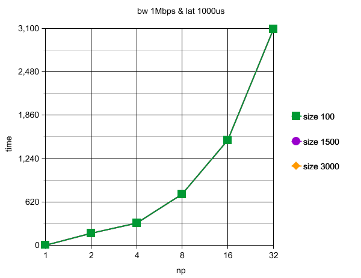
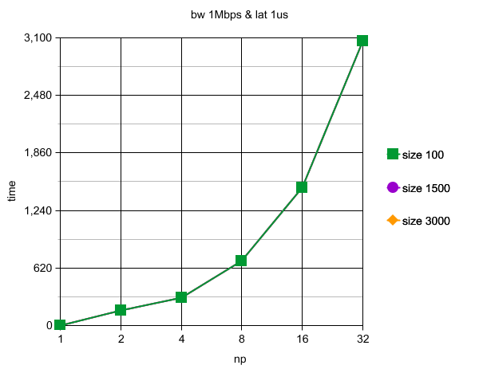
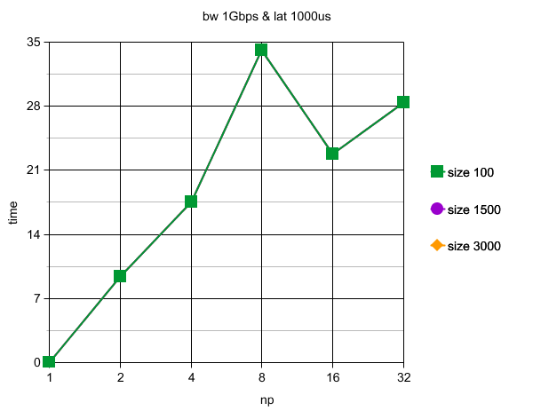

# Entrega.md

## Identificação

Nome: Rafael Vales Bettker

Disciplina: ELC139 - Programação Paralela

Plataforma: [specs.txt](../t2/specs.txt)

## Parte 1

O código desenvolvido para os testes pode ser encontrado em [parte1.c](parte1.c).

Quando o número de processos cresce, consequentemente aumenta o número de envios e recebimentos da mensagem, e também o tempo de execução. O tempo foi obtido a partir da média de 10 execuções com tal configuração.

A tabela com os resultados desses gráficos pode ser vista em [results_p1.csv](results_p1.csv).

## Parte 2

A variação do tamanho do vetor entre 100 e 3000 não pôde ser percebida no tempo de execução.

A tabela com os resultados desses gráficos pode ser vista em [results_p2.csv](results_p2.csv).

## Referências

- Slides. Operações Coletivas em MPI. https://github.com/AndreaInfUFSM/elc139-2019a/tree/master/slides
