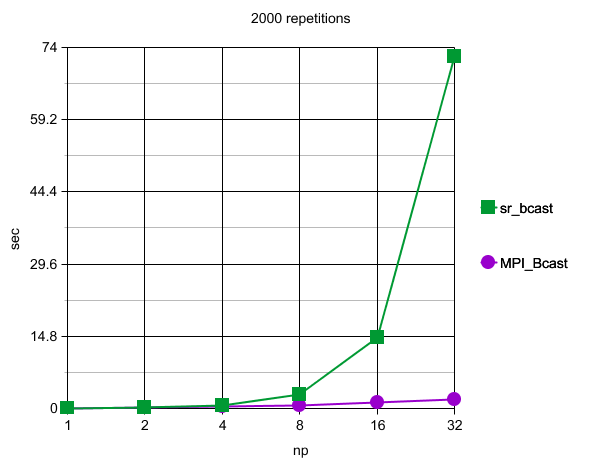
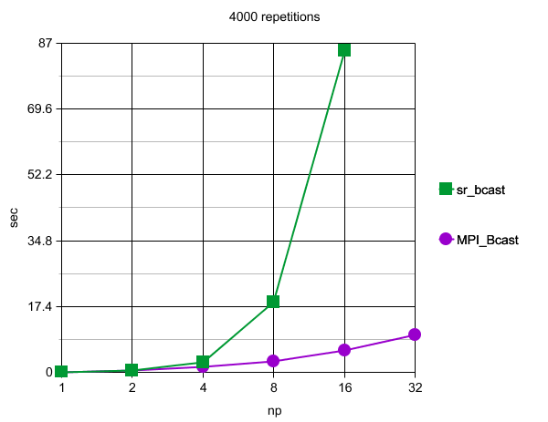
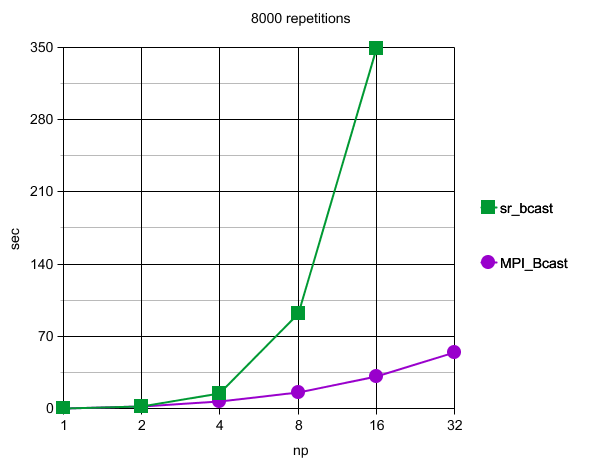
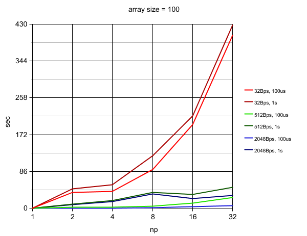
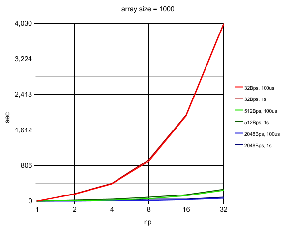
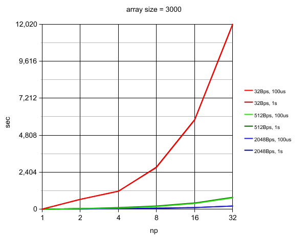

# Entrega.md

## Identificação

Nome: Rafael Vales Bettker

Disciplina: ELC139 - Programação Paralela

Plataforma: [specs.txt](../t2/specs.txt)

## Parte 1

O código desenvolvido para os testes pode ser encontrado em [parte1.c](parte1.c). Nele foi adicionado um laço de repetição que faz o envio repetidas vezes para obter um maior tempo de execução.

Quando o número de processos cresce, consequentemente aumenta o número de envios e recebimentos da mensagem, e também o tempo de execução. O tempo foi obtido a partir da média de 10 execuções com tal configuração.

A tabela com os resultados desses gráficos pode ser vista em [results_p1.csv](results_p1.csv).

## Parte 2

A largura de banda variou entre 32, 512 e 2048 Bps, a latência entre 100us e 1s, e o tamanho do vetor entre 100, 1000 e 3000.

Como recomendado, em "host-speed" foi utilizado o valor de 6.7 GFLOPs (3.35GFLOPs x 2 cores) encontrado na tabela de CPU performance para o meu processador.

A tabela com os resultados desses gráficos pode ser vista em [results_p2.csv](results_p2.csv).

## Referências

- Slides. Operações Coletivas em MPI. https://github.com/AndreaInfUFSM/elc139-2019a/tree/master/slides
- DeinoMPI. MPI_Wtime() function. https://mpi.deino.net/mpi_functions/MPI_Wtime.html
- SETI@home. CPU performance. https://setiathome.berkeley.edu/cpu_list.php
